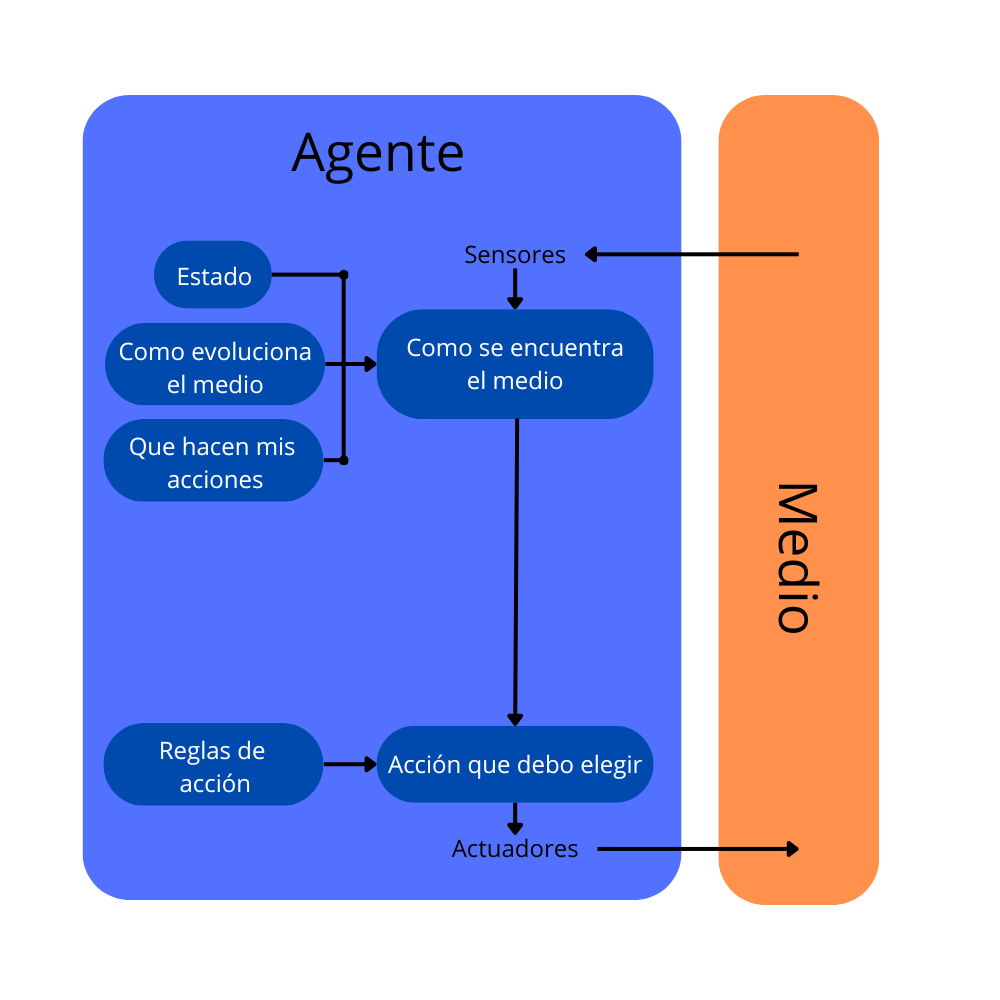

# Guess Who

Agente inteligente para Guess Who (Quien es quien)

Este codigo permite adivinar el personaje mediante consultas a una base de datos Prolog

## Optimización VS Busquedas

El quien es quien es un buen ejemplo de problema de optimización puesto que el rendimiento de la partida depende completamente de la calidad de las preguntas realizadas. En el caso de que las cuestiones abarquen demasiados personajes no nos facilitaran demasiada informacion, y en caso de ser demasiado precisas es mas complicado que nos den informacion relevante. Por este motivo es muy importante encontrar un balance a la hora de realizar las preguntas para maximizar la informacion obtenida.

## Entorno de tareas

Entorno de tareas | Observable| Agentes | Determinista | Episódico | Estático | Discreto | Conocido
:---: | :---: | :---: | :---: | :---: | :---: | :---: | :---: |
 GuessWho | Parcial | Multi | Estocástico | Secuencial | Estático | Discreto | Conocido |

## Algoritmo

Este algoritmo busca seleccionar caracteristicas de los personajes de forma que se creen dos grupos del mismo tamaño. De esta forma empezando con 24 personajes la primera pregunta podia ser "Tu personaje es calvo, y tiene gafas y las mejillas rojas", separando los personajes en dos grupos de 12. Y continuaria de esta forma hasta encontrar al personaje correcto.

Por lo que de media el personaje se acertará en unos 6 intentos.

## Estructura del agente



## Programación lógica


## Base de Datos Prolog


## Requisitos

- Conda
- Python 3.10
- Pysweep

## Instalación

- Instala Conda
- Crear directorio
- Clonar el proyecto
- Inicializa el entorno virtual y actívalo.
```bash
$ conda create -n guesswho python=3.10
$ conda activate guesswho
```
- Instala las dependencias.
```bash
$ pip install -r requirements.txt
```